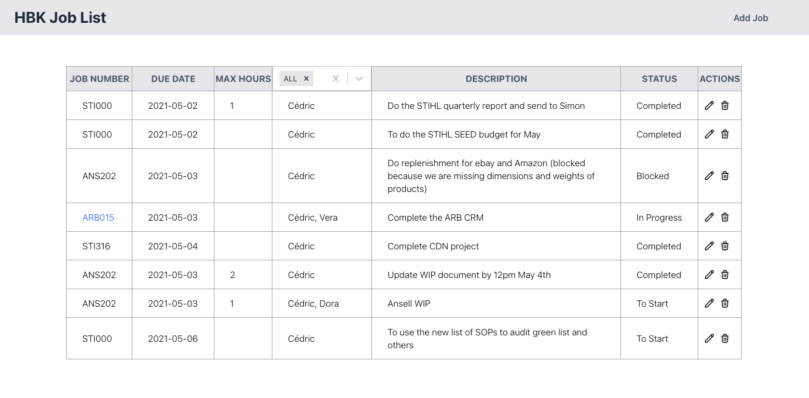
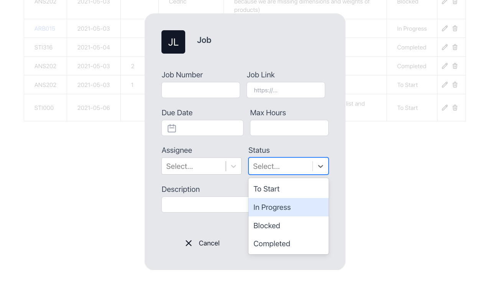
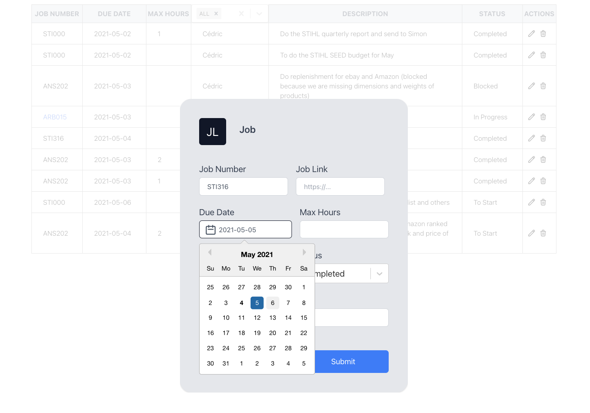

# Job List 

The job list web application is a digitised version of HBK's daily job list. It allows Digital Producers / Project Managers to manage jobs to be assigned to the digital team.

## Features

- Create, read, update, delete jobs
- Have multiple assignees and can be filtered by assignee
- Email job list to all members of the digital team (todo)

## Installation

1. `git clone <this_url> && cd <repo_name>`
2. `cd backend`
3. `npm install`
4. `vim .env`
5. Inside the .env file: MONGODB_URI="<db_link>" then save and quit
6. `npm run dev`
6. In new terminal tab: `cd ../frontend`
7. `npm install`
